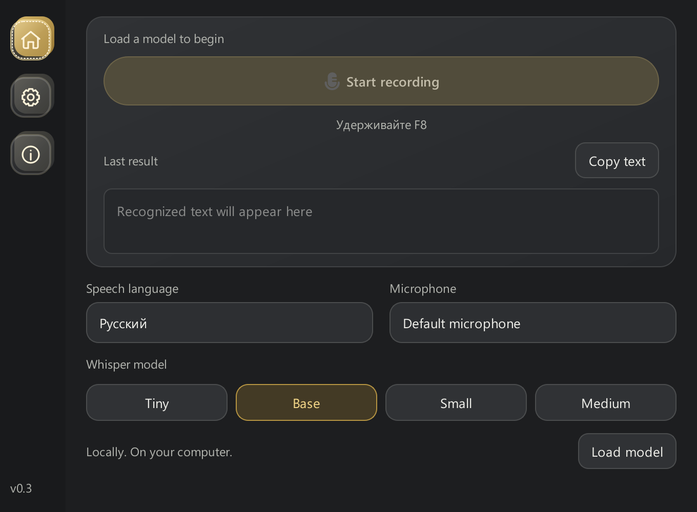
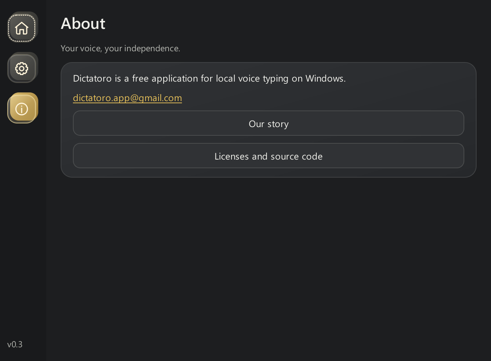
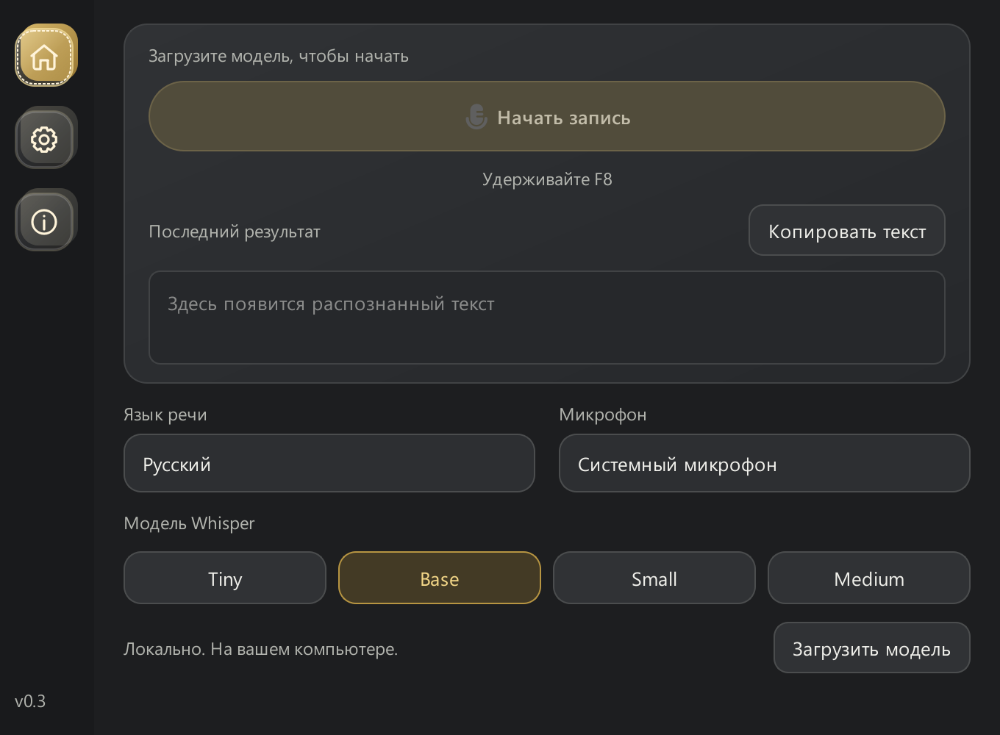
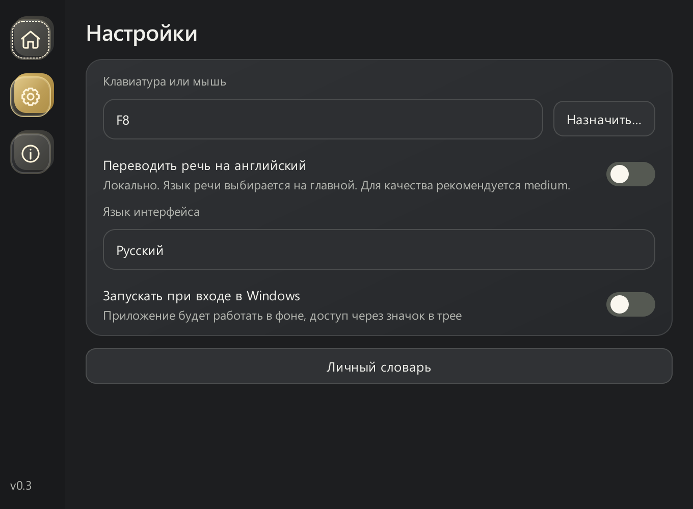
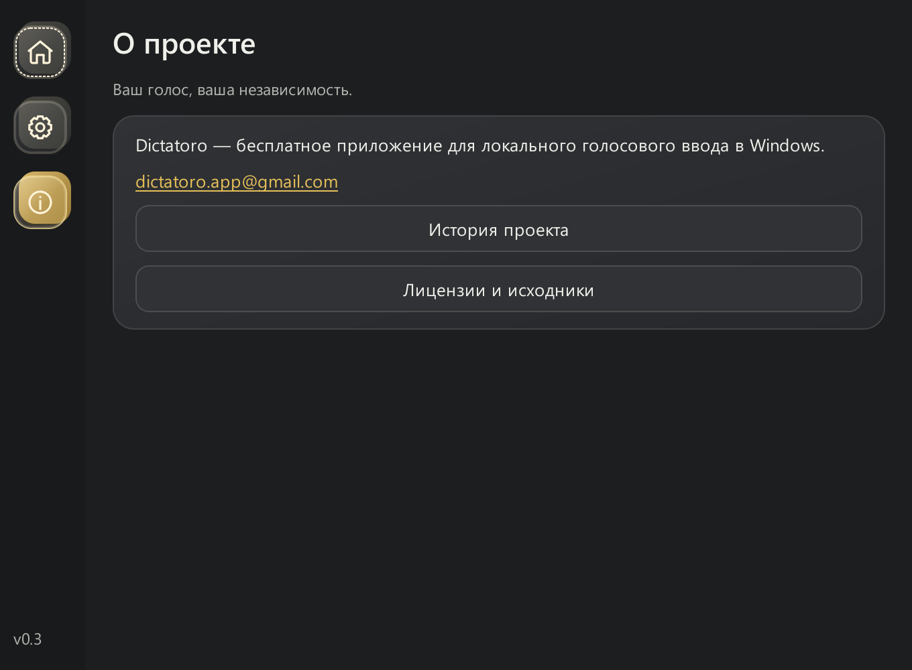

# Dictatoro 0.3 — Preview

Private, local speech-to-text for Windows 10 (1809+) and Windows 11, x64.
A free project maintained by [bukaivan](https://github.com/bukaivan).
Application code: MIT. Dependencies retain their own licenses.

## Project status

This repository publishes the source of an early Windows desktop application.
A public installer is not included in this initial publication. Windows signing,
third-party native dependency review and clean-machine validation remain in progress.
See [release readiness](RELEASE-READINESS.md) for completed checks and open issues.

The project is maintained at [bukaivan/dictatoro](https://github.com/bukaivan/dictatoro).
Report reproducible bugs through [GitHub Issues](https://github.com/bukaivan/dictatoro/issues).
Please do not include private dictation, recordings or account credentials.

## Features

- Hold a keyboard key, middle mouse button or side button to dictate.
- Insert text into the focused application using the clipboard and Ctrl+V.
- Local Whisper Tiny, Base, Small and Medium models, using CPU inference.
- Optional translation into English, microphone selection and personal vocabulary.
- Windows sign-in startup and eight interface languages: Russian, English, Polish,
  Spanish, German, French, Arabic and Simplified Chinese.

## Screenshots

Actual preview interface, captured with isolated defaults before loading a model.
These images show the UI, not a live transcription or a recognition benchmark.

Settings and About

Русский интерфейс

## Installation

**Can I download and install it now?** This publication contains source code.
GitHub's **Code → Download ZIP** downloads the source, not a Windows installer.
There is currently no ready-to-install public release.

There is no supported public installer yet. Developers can follow [BUILDING.md](BUILDING.md)
to prepare the runtime and build a local preview. Model weights and runtime binaries
are not stored in this repository; the build tools fetch pinned upstream inputs.

The following describes the local preview installer, not an available public download.
Run `Dictatoro-0.3-Base-Preview-Setup.exe` only after building your own preview.
Choose a folder and installation language. The installer currently offers five
languages; all eight interface languages are available in the application settings.

Python and application libraries are included. Internet may be required during
installation: missing Intel OpenMP Runtime 2025.2.1 and Microsoft Visual C++ x64
are downloaded directly from their vendors, with pinned SHA-256 checks. Their
installers show their own terms and may request administrator permission.
Intel installation requires interactive setup. The multilingual Base model is included
and selected on a fresh installation: no model download is required to start dictating.
Tiny, Small and Medium are optional downloads; cached models work offline. Upgrades
preserve the previously selected model. Allow several gigabytes for larger models.

This is an unsigned preview, not a stable release. Windows Smart App Control has
blocked its uninstaller on a tester's computer, preventing removal through both
the app menu and Windows Settings. This remains unresolved; signed-release build
support is present, but a trusted signing provider and validation are still pending.
Windows may also display reputation warnings. Publication on GitHub does not mean
certification by Microsoft or OpenAI.

## Use

On Home, choose the speech language, microphone and model. Download the selected
model if not cached. In Settings, choose a recording key or supported mouse button.
Focus a text field, hold the button, speak and release. The Home recording button
also starts and stops recording. One recording is limited to two minutes.

Start with Base. Small or Medium may improve accuracy but take longer on a CPU.
Accuracy varies by language, microphone and noise. Personal vocabulary provides
hints, not guaranteed replacements, and is not used in translation mode.

The mouse trigger uses a button press, not wheel scrolling. Left/right mouse
buttons are not assignable. Keyboard triggers are single physical keys; combinations
and some hardware-only Fn keys are not supported.

## Privacy and limitations

Recognition runs locally. Base is already included; other models need a one-time download. Microphone audio is processed in
memory without writing recordings to files in normal operation. Recognized text
replaces the clipboard. Windows clipboard history or synchronization may retain or
synchronize it; the system clipboard should not be treated as private storage.

Insertion is cancelled if the foreground window or its process changes. Switching
fields within one window is not detected. Protected fields and elevated programs
may reject insertion; the result remains available in Dictatoro.
No cloud transcription is required. Network is used for model/dependency downloads.

## Update and uninstall

Exit the old app through its tray menu, then run the installer into the existing
application directory. The legacy data directory `%LOCALAPPDATA%\Diktatoro` is
retained for settings/models compatibility. Installing elsewhere does not delete
an old manually extracted copy.

Uninstall through Windows Settings > Apps > Dictatoro. Interactive uninstall offers
to remove models, settings and logs; silent uninstall preserves them. Shared
Microsoft and Intel runtimes are not removed.

Known issue: the unsigned preview's uninstaller can be blocked by Smart App Control,
as described above. Do not disable Windows protection to use this preview. Ordinary
automated uninstall tests did not cover Smart App Control enforcement.

## Roadmap

- Compare leading local speech recognition engines on shared multilingual samples,
  prioritizing accuracy before latency and memory use. Publish methods and results.
- Improve Windows installation, updates and removal; finish native dependency review,
  arrange trusted code signing and validate on clean Windows systems.
- Develop a macOS version after the Windows release is ready.

These are planned milestones, not features available in this preview.

## Development

See [BUILDING.md](BUILDING.md), [RUNTIME.md](RUNTIME.md) and
[PUBLICATION-CHECKLIST.md](PUBLICATION-CHECKLIST.md). The pinned bootstrap prepares the embedded runtime from official downloads.
A clean Windows installation remains a release gate. Sample recognition benchmarks do not guarantee every microphone's results.

## Licenses and feedback

Application code: [MIT](LICENSE), copyright 2026 bukaivan.
Third-party components: [notices](legal/NOTICES.md) and
[source access / LGPL library replacement](legal/SOURCE_ACCESS.md).
MIT does not replace Qt, Intel, model or other dependency licenses.

Contact: [dictatoro.app@gmail.com](mailto:dictatoro.app@gmail.com).
Remove personal text, audio, tokens and local account paths from public bug reports.
